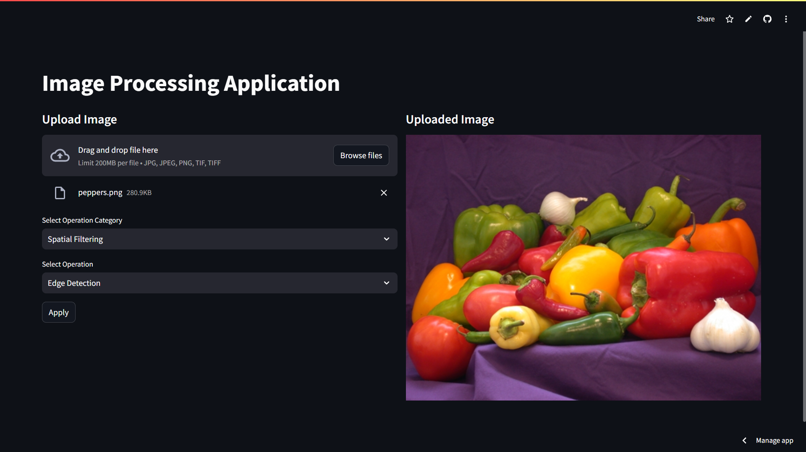
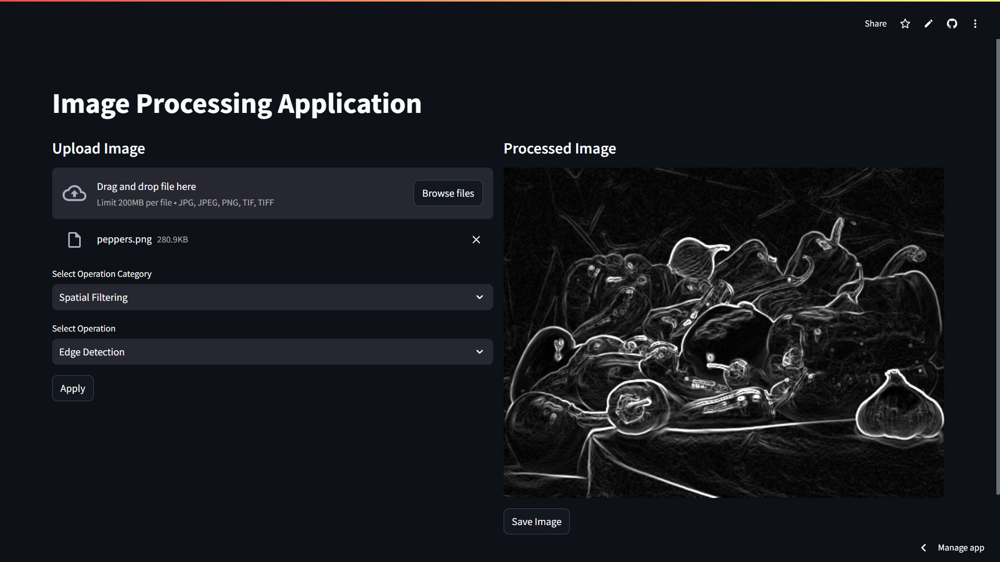

<h1>Gimp</h1>

  

<a href="https://gimpol.streamlit.app">Gimp</a> is an image processing application that contains many options to enhance images or extract certain featues from them. It is implemented using python and streamlit library.

 

<h2>Features</h2>
<ul>
  <li>Color conversion.</li>
  <li>Brightness and contrast adjustment.</li>
  <li>Complement, log and gamma correction.</li>
  <li>Histogram stretching and equalization.</li>
  <li>Blurring, smoothing and edge detection.</li>
  <li>Rank order filters.</li>
  <li>Fourier transform.</li>
  <li>Ideal, butterworth and gaussian filtering.</li>
</ul>
 

    <i>Example of edge detection</i>
  

<h2>Installation</h2>
<ol>
  <li>Clone the repository<pre><code>git clone https://github.com/smoawad66/gimp.git</code></pre></li>
  <li>Install dependencies<pre><code>pip install -r requirements.txt</code></pre></li>
  <li>Run the application <code>streamlit run app.py</code></li>
  <li>The application should work correctly.</li>
</ol>
